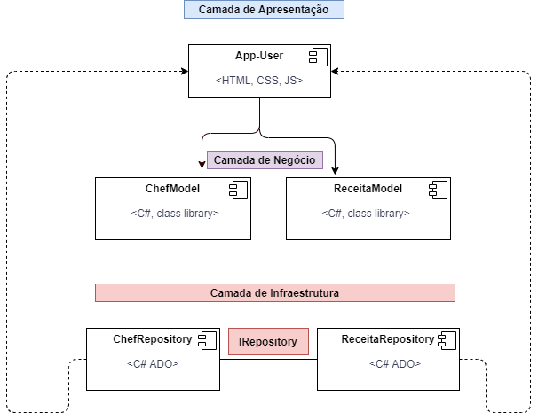
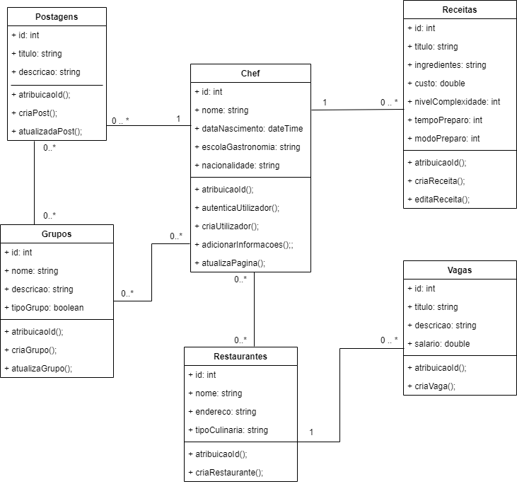

## Projeto de Bloco Desenvolvimento .NET - Assessment Test
### Professor: Júlio César Ferreira Ramos Guimarães
### Aluna: Karine Jorge Horta Ribeiro
***

### Documento de Requisitos - The ChefBook

### Propósito do documento
Este documento visa especificar quais os requisitos necessários para o bom desenvolvimento do projeto/produto. Serão fornecidas informações de forma a ser possível realizar estimativas temporais e de realização, avaliando quais serão as tecnologias e ferramentas necessárias para o alcance daquilo que se é pretendido. Para além disto serão abordados detalhes de qual é o fluxo esperado do produto. O objetivo principal é de que o presente documento consiga transmitir, de maneira clara e objetiva, quais as necessidades do produto.

### Escopo do projeto
Criação de uma rede social para Chefs culinários. O intuito é ter um local de partilha de informações, novidades, e outras coisas mais do mundo gastronômico, fazendo com que sirva como um lugar de reunião destas informações. Para além disto, é pretendido que sirva como uma espécie de networking para os Chefs, seja para divulgação de um novo restaurante, ou divulgação de vaga de emprego, pensando assim em ajudar os colegas que atuam na mesma área. Os utilizadores poderão fazer postagens com receitas/eventos/fotos, poderão ter a sua página pessoal, pensada como uma espécie de "portfolio", ter grupos, interagir com outros Chefs, entre outros.

### Requisitos de Usuário
|Requisito|Tópico|Descrição|
|---------|------|---------|
|R01|Participantes|A rede social será exclusiva para Chefs de Cozinha.|
|R02|Postagens|Os integrantes podem postar livremente tudo aquilo que for relacionado com o mundo da gastronomia, que será exibido numa espécie de feed com as postagens mais recentes.|
|R03|Divulgação de emprego|Os integrantes podem divulgar vagas do estabelecimento onde trabalham ou se estiverem à procura de emprego.|
|R04|Conexões|Os integrantes poderão adicionar uns aos outros, formando uma rede de contatos.| 
|R05|Interações|Os utilizadores da rede social podem comentar, curtir e compartilhar as postagens de outros participantes.|
|R06|Grupos|Será possível fazer a criação de grupos voltados para uma temática específica, da escolha do criador.|
|R07|Receitas|Os integrantes terão uma página específica para a criação de receitas, com todos os tópicos inerentes às mesmas.|
|R08|Divulgação de estabelecimento|Os utilizadores poderão divulgar os lugares onde trabalham ou algum restaurante recém inaugurado.|
|R09|Criação de Eventos|Será possível criar eventos calendarizados, como a abertura de um novo restaurante, por exemplo.|
|R10|Página pessoal|O utilizador poderá criar o seu perfil, como uma espécie de portfolio, contando um pouco da sua história no mundo gastronômico.|

### Requisitos de Sistema - Casos de Uso
**_RS01_**
|Requisito:|Fazer o registro no sistema|
|:----|:----|
|Atores:|Utilizador (_Chef_) e sistema.|
|Pré-Condições:|Possuir um endereço de e-mail.|
|Fluxo básico:|O utilizador fornece um endereço de e-mail, deve criar uma senha de acordo com os critérios de segurança, e confirmar a informação inserida; Os dados introduzidos são validados, é feito uma persistência deles no sistema e como contrapartida disto é disparado um e-mail com link de validação do e-mail; O utilizador deve acessar o seu e-mail para clicar no link; Após ter clicado no link as informações serão validadas e o utilizador será redirecionado para a página de criação do seu perfil.|
|Fluxos alternativos:|O e-mail introduzido é inexistente:  • É devolvida mensagem para o utilizador com a informação; A senha introduzida não obedece aos critérios de segurança:  • É devolvida mensagem para o utilizador informando quais os critérios que precisam ser preenchidos; O e-mail introduzido já está cadastrado no sistema:  • É apresentada mensagem para o utilizador solicitando que insira um endereço diferente.|
|Regra de validação:|A senha deve ser compatível com o critério: 1 maiúscula, 1 caracter especial; O e-mail introduzido deve ser válido.|
|Pós-Condições:|Depois de toda a informação introduzida e validada, a conta é criada.|

**_RS02_**
|Requisito:|Autenticação|
|:----|:----|
|Atores:|Utilizador (_Chef_) e sistema.|
|Pré-Condições:|Possuir um registro no sistema.|
|Fluxo básico:|O utilizador insere suas credenciais (e-mail e senha).|
|Fluxos alternativos:|O endereço de e-mail não está cadastrado no sistema:  • É devolvida mensagem para o utilizador; A senha introduzida é inválida:  • É solicitado ao utilizador que digite a senha novamente. Depois de 2 tentativas apresenta a opção _"Esqueceu senha?"_|
|Regra de validação:|Verificação se utilizador e senha são compatíveis com o que existe cadastrado no sistema.|
|Pós-Condições:|O utilizador é redirecionado à página inicial do sistema.|

**_RS03_**
|Requisito:|Imagens|
|:----|:----|
|Atores:|Utilizador (_Chef_) e sistema.|
|Pré-Condições:|Possuir um diretório de imagens.|
|Fluxo básico:|O utilizador procura uma imagem no diretório de arquivos do seu computador; O utilizador deve escolher a imagem com base no formato e tamanhos suportados, mediante o local(perfil/timeline/receita) onde queira fazer o upload.|
|Fluxos alternativos:|O tamanho da imagem excede o limite:  • É devolvida mensagem para o utilizador com o tamanho máximo aceitado; A imagem não se encontra no formato esperado:  • É devolvida mensagem para o utilizador com o formato aceitado.|
|Regra de validação:|Não há.|
|Pós-Condições:|É adicionada a imagem ao perfil/timeline/receita do utilizador.|

**_RS04_**
|Requisito:|Postagens|
|:----|:----|
|Atores:|Utilizador (_Chef_).|
|Pré-Condições:|Possuir uma conta criada no sistema.|
|Fluxo básico:|O utilizador acessa à sua conta e é levado à página inicial após o login; O utilizador dispõe da opção _**New Post**_, e clicando nela consegue fazer um novo post; O utilizador deve selecionar o tipo de postagem, se será: receita, divulgação de estabelecimento, evento ou publicação; O utilizador insere aquilo que pretende e depois submete a postagem.|
|Fluxos alternativos:|Se pretender não realizar a postagem o utilizador cancela a operação.|
|Regra de validação:|Não há.|
|Pós-Condições:|É feita a postagem pretendida na timeline do utilizador.|

**_RS05_**
|Requisito:|Página Pessoal|
|:----|:----|
|Atores:|Utilizador (_Chef_) e sistema.|
|Pré-Condições:|Possuir uma conta criada no sistema.|
|Fluxo básico:|O utilizador acessa à sua conta, e vai na parte do seu perfil através do botão _Perfil_; O utilizador clica em _Editar Perfil_ e insere informações como:  • _Nome; Cidade onde reside; Data de Nascimento; Nacionalidade; Escola de gastronomia que frequentou; Nome do restaurante (próprio ou onde trabalha); Interesses; Especialidades; Contato preferencial (e-mail ou telefone)_; O utilizador pode definir se **quer que a idade seja exibida**; O utilizador insere a sua imagem de perfil; Após ter os campos pretendidos preenchidos, o utilizador deve guardar a informação.|
|Fluxos alternativos:|Se o utilizador não clicar em gravar é exibida mensagem de que os dados não foram guardados e que as informações serão perdidas; Se o utilizador deixar o campo do _Nome_ e da _Data de Nascimento_ em branco não conseguirá gravar:  • Será retornada mensagem de que os campos são **obrigatórios**;  Se o utilizador não quiser avançar com a edição cancela a operação.|
|Regra de validação:|O campo _Nome_ e _Data de Nascimento_ são de preenchimento obrigatório.|
|Pós-Condições:|A página pessoal do Chef é atualizada com as informações preenchidas.|

### Matriz de Rastreabilidade
|ID|Nome|Solicitante|Complexidade|Prioridade|Requisito Relacionado|Status|
|:-:|:--:|:--------:|:----------:|:--------:|:-------------------:|:----:|
|RS01|Registro no sistema|Equipe ITD|Baixa|Alta|n/a|Concluído|
|RS02|Autenticação|Equipe ITD|Alta|Alta|RS01|Concluído|
|RS03|Imagens|Equipe CMS|Média|Média|RS01 e RS02|Em andamento|
|RS04|Postagens|Equipe CMS|Média|Média|RS01 e RS02|Por iniciar|
|RS05|Página Pessoal|Equipe ITD|Média|Alta|RS01 e RS02|Por iniciar|

### Diagrama de Classes

### Postagem Rede Social

### Análise do Desenvolvimento em Camadas
Foi utilizado o modelo de desenvolvimento em camadas - _CMMI (Capability Maturity Model Integration)_ ao longo do projeto de bloco, com o objetivo de mostrar como dividir a aplicação de forma a deixa-la estruturada de acordo com uma sequência lógica do que cada operação realizava no projeto. 
O modelo em cascata serve como referência para que as empresas possam implementar melhorias nos processos e fazer a manutenção de produtos, pois considera alguns fatores como prazos e custos, gerenciamento do desenvolvimento de software, etc. Na área do software um processo pode ser designado como um conjunto de atividades que possuem como objetivo o alcance de uma meta pré-estabelecida. A capacidade e maturidade de um processo servem para que se tenha uma noção do grau de qualidade que um processo pode atingir um resultado. 
O tópico abordado tem grande importância para que se possa aprender a estrutura do desenvolvimento de software e todas as suas vertentes. Desde a coleta das necessidades do projeto, até a estruturação daquilo que será feito, montando todos os passos e definindo-os em projetos, para que a execução ficasse de forma mais organizada.  
No decorrer do projeto de bloco foi possível perceber que é uma etapa necessária, para poder entender aquilo que será desenvolvido, e também ter a noção da importância de ter toda esta estruturação prévia. Anteceder os passos a serem desenvolvidos faz com que hajam menos chances para erros ou falhas na rota ao longo do percurso de desenvolvimento da aplicação, uma vez que existe um guideline.  
Embora seja importante para o desenvolvimento correto da aplicação, é inegável que também há certa dificuldade em sua implementação, uma vez que tendo as classes e outros itens do projeto criados, distribuí-los não é tarefa fácil.  
Desta forma, acredito que o modelo de desenvolvimento em camadas deve ser aplicado quando se tem exatamente a noção daquilo que irá ser feito a nível do projeto, quando estiver com a aplicação bem estruturada, para que haja o mínimo de alterações no decorrer do percurso.

#### Referências
_https://www.devmedia.com.br/cmmi-uma-visao-geral/25425; 
https://cmmiinstitute.com/cmmi; 
Projeto de Bloco: Desenvolvimento .NET | Roteiro de Aprendizagem da Etapa 2 
Projeto de Bloco: Desenvolvimento .NET | Roteiro de Aprendizagem da Etapa 3 
Projeto de Bloco: Desenvolvimento .NET | Roteiro de Aprendizagem da Etapa 4 
Projeto de Bloco: Desenvolvimento .NET | Roteiro de Aprendizagem da Etapa 5_ 
